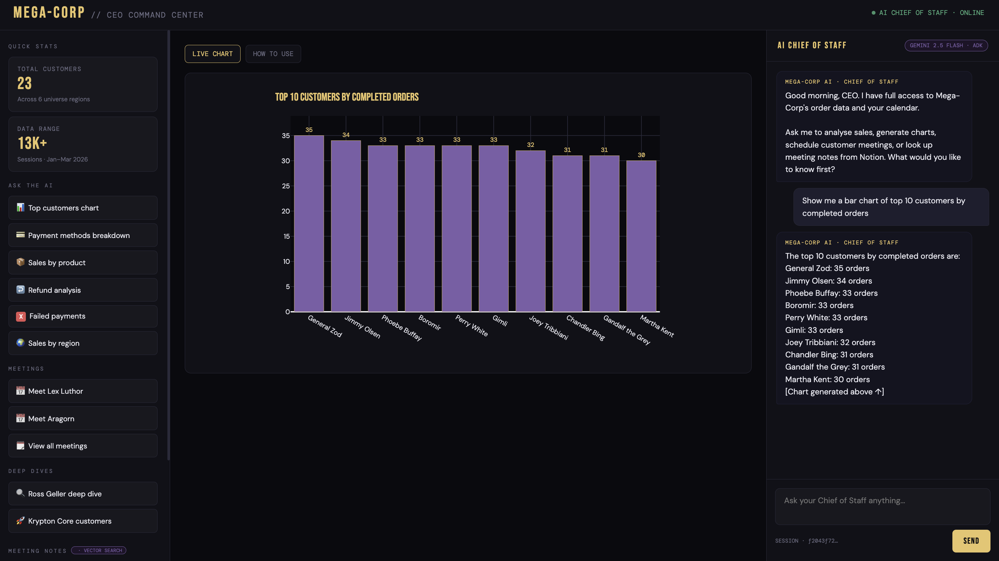
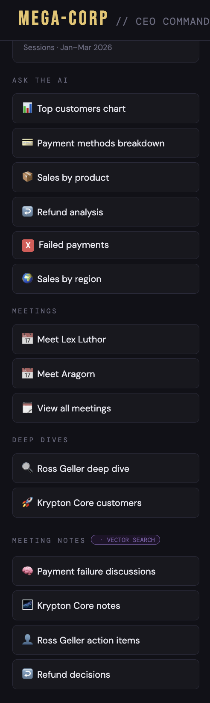
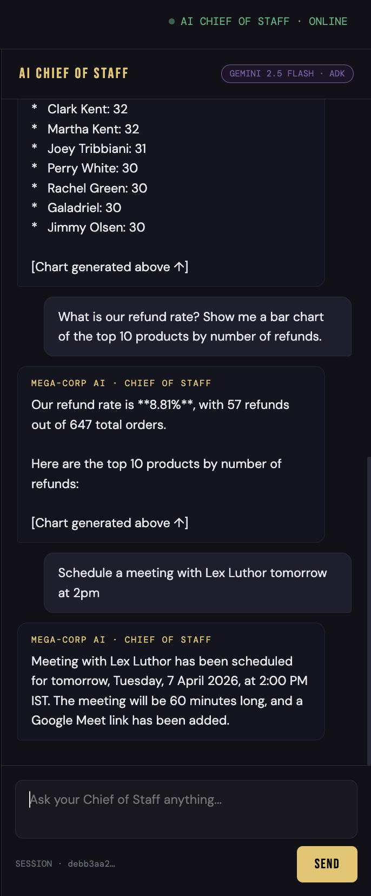
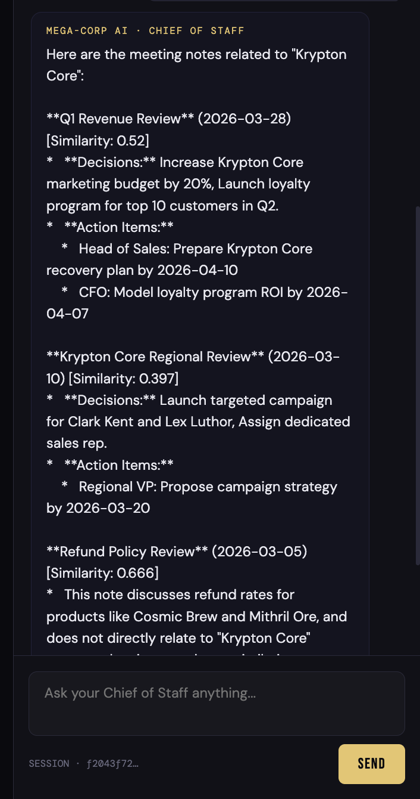
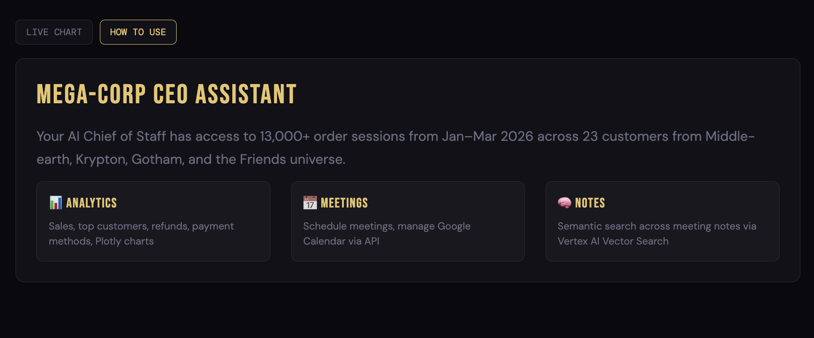

# Mega-Corp · CEO Command Center

> An AI-powered virtual assistant for the CEO of Mega-Corp Universe — built on Google ADK, a multi-agent architecture, MCP tooling, and a real-time Dash dashboard.

---

## What it does

The CEO Command Center gives the CEO of Mega-Corp Universe a single interface to:

- **Analyse order & session data** — ask natural-language questions about sales, customers, revenue, refunds, and payment failures. The AI queries BigQuery and returns answers with live Plotly charts rendered directly in the dashboard.
- **Schedule meetings** — instruct the assistant to book, view, or update calendar events. It creates events directly in Google Calendar via MCP.
- **Review meeting notes** — retrieve and semantically search past meeting notes via Vertex AI Vector Search, surfacing decisions, action items, and open questions.
- **Run deep-dive workflows** — combine all three in one request, e.g. *"Analyse Ross Geller's order history, then schedule a follow-up with him this Friday."*

---

## Screenshots

### Full dashboard — live chart + chat panel
The main view shows the KPI sidebar on the left, a live Plotly bar chart of top customers by completed orders in the centre, and the AI chat panel on the right mid-conversation.



---

### Sidebar — quick actions
One-click shortcuts for analytics queries, meeting scheduling, deep dives, and semantic meeting note search (powered by Vertex AI Vector Search).



---

### Chat panel — analytics + calendar in one session
The assistant answers a refund rate query, renders a chart, then immediately schedules a meeting with Lex Luthor for the next day — all in the same conversation thread.



---

### Meeting notes — semantic search
Searching for "Krypton Core" surfaces three relevant meeting notes ranked by similarity, each with structured decisions and action items extracted automatically.



---

### How to use panel
The "How to Use" tab explains the three sub-agents available to the CEO: Analytics (BigQuery + Plotly), Meetings (Google Calendar via MCP), and Notes (Vertex AI Vector Search).



---

## Architecture

```
Dash UI  (port 8050)
    │  HTTP POST /run
    ▼
ADK API Server  (port 8000)
    │
    ▼
CEO Assistant Agent  ── orchestrator (Gemini 2.5 Flash)
    ├── bq_agent          ← BigQuery: orders, sessions, customers
    ├── calendar_agent    ← Google Calendar via MCP
    └── notes_agent       ← Notion / Vertex AI Vector Search via MCP
```

**Tech stack**

| Layer | Technology |
|---|---|
| LLM | Gemini 2.5 Flash |
| Agent framework | Google ADK |
| Agent-to-agent routing | ADK native sub-agent delegation |
| External tools | MCP (Google Calendar, Notion) |
| Meeting notes search | Vertex AI Vector Search |
| Data warehouse | BigQuery |
| Dashboard | Dash + Plotly + Dash Bootstrap Components |
| Containerisation | Docker Compose |

---

## Project structure

```
hackathon-mega-corp/
├── agent/
│   ├── __init__.py
│   ├── agent.py                  # Orchestrator — root_agent
│   ├── sub_agents/
│   │   ├── __init__.py
│   │   ├── bq_agent.py           # BigQuery data agent
│   │   ├── calendar_agent.py     # Google Calendar MCP agent
│   │   └── notes_agent.py        # Notion / notes MCP agent
│   └── tools/
│       └── bq_tools.py           # list_tables, get_schema, run_query
├── dashboard/
│   └── app.py                    # Dash app — UI + ADK API client
├── Dockerfile.adk
├── Dockerfile.dash
├── docker-compose.yml
├── requirements.txt              # ADK service dependencies
└── requirements.dash.txt         # Dash service dependencies
```

---

## Prerequisites

- Python 3.11+
- Docker Desktop
- A Google Cloud project with:
  - BigQuery dataset populated with Mega-Corp order/session data
  - A service account key JSON with BigQuery read access
  - Vertex AI Vector Search index for meeting notes (optional — for semantic search)
- Google ADK installed: `pip install google-adk[mcp]`

---

## Running locally

### Option A — Docker Compose (recommended)

**1. Clone the repo**

```bash
git clone https://github.com/your-org/hackathon-mega-corp.git
cd hackathon-mega-corp
```

**2. Add your service account key**

Place your GCP service account JSON at the project root:

```
ai-agent-use-cases-XXXXXX-XXXXXXXXXXXX.json
```

**3. Create a `.env` file**

```env
GCP_PROJECT_ID=your-gcp-project-id
BQ_DATASET=hackathon_mega_corp_universe
GOOGLE_APPLICATION_CREDENTIALS=/secrets/sa-key.json
```

**4. Build and start both services**

```bash
docker compose up --build
```

**5. Open the dashboard**

```
http://localhost:8050
```

The ADK API server runs at `http://localhost:8000`. Swagger docs at `http://localhost:8000/docs`.

---

### Option B — Local dev (no Docker)

**1. Install dependencies**

```bash
pip install -r requirements.txt
pip install -r requirements.dash.txt
```

**2. Set environment variables**

```bash
export GCP_PROJECT_ID=your-gcp-project-id
export BQ_DATASET=hackathon_mega_corp_universe
export GOOGLE_APPLICATION_CREDENTIALS=./ai-agent-use-cases-XXXXXX.json
export ADK_API_URL=http://localhost:8000
```

**3. Start the ADK API server** (terminal 1)

```bash
adk api_server agent
```

**4. Start the Dash app** (terminal 2)

```bash
python dashboard/app.py
```

**5. Open the dashboard**

```
http://localhost:8050
```

---

## Quick actions

Once the dashboard is open, use the left sidebar to instantly trigger pre-built queries:

| Section | Button | What it does |
|---|---|---|
| Ask the AI | Top customers chart | Bar chart of top 10 customers by completed orders |
| Ask the AI | Payment methods breakdown | Pie chart of payment methods across all orders |
| Ask the AI | Sales by product | Bar chart of revenue per product |
| Ask the AI | Refund analysis | Refund rate + most-refunded products |
| Ask the AI | Failed payments | Customers with payment failures |
| Ask the AI | Sales by region | Revenue breakdown by universe region |
| Meetings | Meet Lex Luthor | Schedule a meeting tomorrow at 2pm |
| Meetings | Meet Aragorn | Schedule a meeting next Monday at 10am |
| Meetings | View all meetings | List all upcoming calendar events |
| Deep Dives | Ross Geller deep dive | Full order analysis + Friday meeting booked |
| Deep Dives | Krypton Core customers | Customer profiles + purchase history |
| Meeting Notes | Krypton Core notes | Semantic search across all meeting notes |

---

## Data

The dataset covers **13,000+ order sessions** from January–March 2026 across **23 fictional customers** from:

- The Friends universe (Ross Geller, Monica Geller, Phoebe Buffay, Joey Tribbiani…)
- Middle-earth (Aragorn, Gandalf, Legolas, Gimli, Galadriel, Boromir…)
- The DC universe (Lex Luthor, General Zod, Clark Kent, Martha Kent, Lois Lane, Jimmy Olsen…)
- The Krypton Core, Gotham, and other universe regions

---

## Environment variables reference

| Variable | Description |
|---|---|
| `GCP_PROJECT_ID` | Your Google Cloud project ID |
| `BQ_DATASET` | BigQuery dataset name |
| `GOOGLE_APPLICATION_CREDENTIALS` | Path to service account key JSON |
| `ADK_API_URL` | URL of the ADK API server (default: `http://localhost:8000`) |

---

## Troubleshooting

**`/dashboard: not found` during Docker build**
The `dashboard/` directory must exist at the project root with `app.py` inside. Run `mkdir -p dashboard` and ensure `dashboard/app.py` is present before building.

**`{"detail":"Not Found"}` from the ADK API**
Check available routes at `http://localhost:8000/docs`. The ADK `api_server` exposes a FastAPI app — the Swagger UI shows all live endpoints.

**Docker cache corruption (`parent snapshot does not exist`)**
```bash
docker system prune -af
docker builder prune -af
docker compose up --build
```

**`adk web` not working in Docker**
This is expected — `adk web` bundles a browser UI that has issues in headless containers. Use `adk api_server` instead (already configured in `Dockerfile.adk`).